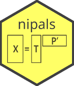

# nipals 

[](https://cran.r-project.org/package=nipals)
[](https://cranlogs.r-pkg.org/badges/nipals)


The 'nipals' package provides a single function to perform Principal Components Analysis of a matrix using Non-linear Iterative Partial Least Squares. NIPALS has been implemented several times in R packages.  This package strives to be the best (fast and accurate) implementation.

Key features:
  
* Missing values are allowed.
* Uses Gram-Schmidt to ensure orthogonal principal components.
* Carefully optimized for speed.
* Flexible options.
* Vignettes and unit tests.

## Installation

```R
# Install the released version from CRAN:
install.packages("nipals")

# Install the development version from GitHub:
install.packages("devtools")
devtools::install_github("kwstat/nipals")
```

## Vignettes

[The NIPALS algorithm](https://github.com/kwstat/nipals/raw/master/vignettes/nipals_algorithm.pdf)

[Comparing NIPALS functions in R](https://github.com/kwstat/nipals/raw/master/vignettes/nipals_comparisons.pdf)

[NIPALS optimization notes](https://github.com/kwstat/nipals/raw/master/vignettes/nipals_optimization.pdf)

## Usage

```R
require(nipals)
data(uscrime, package = "nipals")
dat <- uscrime
dat <- as.matrix(dat[ , -1])

# Gram-Schmidt corrected NIPALS
m3 <- nipals(dat)

round(crossprod(m3$loadings),3) # Prin Comps are orthogonal
##      PC1 PC2 PC3 PC4 PC5 PC6 PC7
##  PC1   1   0   0   0   0   0   0
##  PC2   0   1   0   0   0   0   0
##  PC3   0   0   1   0   0   0   0
##  PC4   0   0   0   1   0   0   0
##  PC5   0   0   0   0   1   0   0
##  PC6   0   0   0   0   0   1   0
##  PC7   0   0   0   0   0   0   1

round(m3$loadings,3)
##              PC1    PC2    PC3    PC4    PC5    PC6    PC7
##  murder    0.296 -0.623  0.178 -0.241  0.540 -0.265 -0.270
##  rape      0.432 -0.171 -0.244  0.060  0.200  0.769  0.299
##  robbery   0.397  0.044  0.496 -0.558 -0.519  0.120  0.005
##  assault   0.399 -0.353 -0.063  0.629 -0.502 -0.166 -0.191
##  burglary  0.440  0.204 -0.211 -0.057  0.095 -0.540  0.645
##  larceny   0.358  0.401 -0.541 -0.231  0.023 -0.037 -0.602
##  autotheft 0.295  0.504  0.567  0.418  0.372  0.054 -0.148

```
